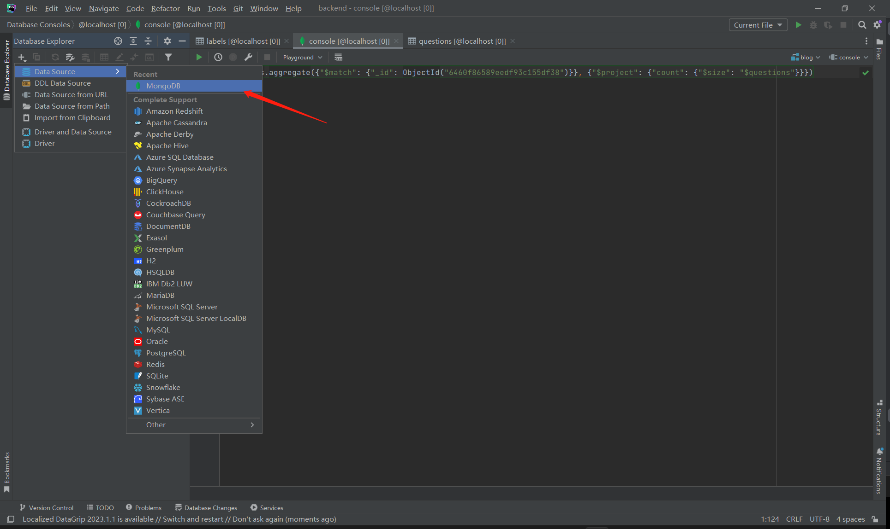

# 3台MongoB Server配置

## MongoDB安装
如若未安装MongoDB，请至少安装MongoDB服务端，即mongod指令。[MongoDB服务端6.0.6下载连接](https://repo.mongodb.org/yum/redhat/7/mongodb-org/6.0/x86_64/RPMS/mongodb-org-server-6.0.6-1.el7.x86_64.rpm)

mongod版本满足4.2以上即可

## MongoDB搭建
创建如下几个文件夹：

```shell
mkdir /var/log/mongodb/
mkdir /var/lib/mongo
mkdir /var/lib/mongo1
mkdir /var/lib/mongo2
```

将当前文件夹下的所有mongod*.conf文件放置如下所示位置：

```shell
cp mongod*.conf /etc/
```

尝试执行如下指令：
```shell
mongod --fork -f /etc/mongod.conf
mongod --fork -f /etc/mongod1.conf
mongod --fork -f /etc/mongod2.conf
```

执行完成后查看MongoDB服务器运行情况：
```shell
ps -aux | grep mongod
```

如果显示三个MongoDB进程即为成功启动。

## 设置MongoDB服务器

成功启动MongoDB后，尝试使用客户端连接MongoDB服务器（这里连接的是10200端口）。这里使用DataGrip进行连接。



输入参数并测试连接成功后，在DataGrip命令行或mongo命令行中输入如下指令：
```mongodb
use admin
# 上条指令成功后执行
config={_id: "rs1",
members: [
{ _id: 0, host: "127.0.0.1:10200",priority:2 },
{ _id: 1, host: "127.0.0.1:10201",priority:1 },
{ _id: 2, host: "127.0.0.1:10202",arbiterOnly:true }
] };
# 上条指令成功后执行
rs.initiate(config)
```

最后一条指令执行成功后，数据库会返回1，此时如果没有问题，所有数据库应当都已经成功连接。

检查所有服务器的master，secondary和arbiter状态：
```mongodb
# 在10200 MongoDB服务器上运行
db.isMaster() # 此处应该返回primary=true
# 在10201 MongoDB服务器上运行
db.isMaster() # 此处应该返回primary=false且arbiter=false
# 在10202 MongoDB服务器上运行
db.isMaster() # 此处应该返回primary=false且arbiter=true
```

## 设置systemctl启动和自启动

检查是否存在systemctl：

```shell
which systemctl
```

如果存在，则会返回systemctl执行地址。

将当前文件夹下的mongod*.service文件复制到如下文件夹中：
```shell
# 这里的复制地址不要死认，可以查看一下自己服务器其他的systemctl服务一般会安装的service文件地址在哪里
cp mongod*.service /usr/lib/systemd/system/
```

复制完成后，尝试使用systemctl启动mongod：
```shell
# 启动前如果mongodb服务器仍然在运行，请直接kill掉所有mongod进程
systemctl start mongod
systemctl start mongod1
systemctl start mongod2
```

查看mongodb运行状况：
```shell
systemctl status mongod
systemctl status mongod1
systemctl status mongod2
```

开机启动MongoDB：
```shell
systemctl enable mongod
systemctl enable mongod1
systemctl enable mongod2
```